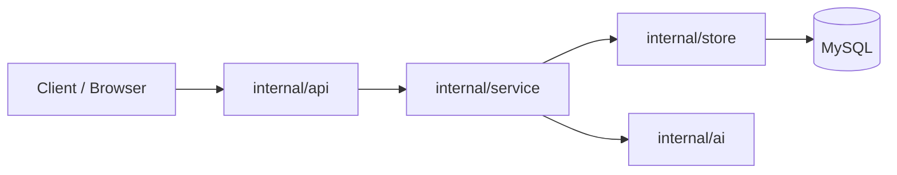

# 后端文件协作说明

本文档说明 MyDashboard 后端各层文件如何配合，帮助快速理解请求路径与职责分工。

## 1. 启动入口与装配

入口文件：`backend/cmd/server/main.go`

启动流程：
- 读取 .env（`loadEnv()`）
- 解析配置（`loadConfig()`）
- 建立 MySQL 连接
- 创建 DeepSeek 客户端（`internal/ai`）
- 创建 Store（`internal/store`）
- 创建 Service（`internal/service`）
- 创建 API Server（`internal/api`）
- 启动 HTTP Server
- 可选启动模拟数据任务（`StartSimulation`）

## 2. API 路由与 Handler

核心文件：
- `backend/internal/api/server.go`
- `backend/internal/api/metrics_handler.go`
- `backend/internal/api/insights_handler.go`
- `backend/internal/api/utils.go`

路由列表：
- `GET /healthz`
- `GET /api/metrics/latest`
- `GET /api/metrics/trend`
- `POST /api/metrics/simulate`
- `GET /api/insights/latest`
- `POST /api/insights`

Handler 职责：
- 解析参数 / 请求体
- 调用 Service 层完成业务
- 返回 JSON 响应

### 接口示例（请求/响应）

健康检查：
```
GET /healthz
```
响应示例：
```json
{"status":"ok"}
```

读取最新指标：
```
GET /api/metrics/latest
```
响应示例：
```json
{
  "data": {
    "revenue": 4.82,
    "growth": 18.6,
    "sentiment": 72,
    "backlog": 128,
    "created_at": "2026-01-23T13:05:00Z"
  },
  "timestamp": "2026-01-23T13:05:12Z"
}
```

读取趋势（支持 window 参数）：
```
GET /api/metrics/trend?window=12
```
响应示例：
```json
{
  "data": [
    {"timestamp":"2026-01-23T12:54:00Z","revenue":5.2},
    {"timestamp":"2026-01-23T12:55:00Z","revenue":5.3}
  ]
}
```

创建洞察（传入 metricKey）：
```
POST /api/insights
Content-Type: application/json

{"metricKey":"revenue"}
```
响应示例：
```json
{
  "data": {
    "id": 12,
    "title": "AI 战略顾问",
    "message": "……",
    "source": "metric",
    "created_at": "2026-01-23T13:05:20Z"
  }
}
```

读取最新洞察（支持 limit 参数）：
```
GET /api/insights/latest?limit=6
```
响应示例：
```json
{
  "data": [
    {
      "id": 12,
      "title": "AI 战略顾问",
      "message": "……",
      "source": "auto",
      "created_at": "2026-01-23T13:05:20Z"
    }
  ]
}
```

模拟下一条指标：
```
POST /api/metrics/simulate
```
响应示例：
```json
{
  "data": {
    "revenue": 5.01,
    "growth": 17.9,
    "sentiment": 73.2,
    "backlog": 132,
    "created_at": "2026-01-23T13:05:30Z"
  }
}
```

## 3. Service 层（业务组织）

核心文件：
- `backend/internal/service/metrics.go`
- `backend/internal/service/insights.go`
- `backend/internal/service/simulation.go`

职责：
- 指标读取、趋势整理、模拟生成
- 洞察生成（AI + 指标趋势）
- 无数据时写入种子数据

## 4. Store 层（数据库访问）

核心文件：
- `backend/internal/store/store.go`

职责：
- 封装 SQL 查询/写入
- 对上提供统一方法：
  - `LatestMetrics`
  - `InsertMetricsAt`
  - `Trend`
  - `LatestInsights`
  - `InsertInsight`

## 5. Models（数据结构）

核心文件：
- `backend/internal/models/metrics.go`
- `backend/internal/models/insight.go`

作用：
- Service 与 Store 之间的数据结构
- API JSON 输出结构

## 6. AI 层（DeepSeek）

核心文件：
- `backend/internal/ai/deepseek.go`

职责：
- 封装 DeepSeek Chat API
- Service 层通过接口 `AIChatBot` 调用

## 7. 数据库结构

核心文件：
- `backend/db/migrations/0001_init.up.sql`

表结构：
- `metrics_snapshot`：指标快照表（最新/趋势）
- `insights`：洞察表

## 8. 端到端请求示意

Mermaid 流程图（可直接渲染）：


读取最新指标：

```
HTTP Request
  -> api/metrics_handler.go
  -> service/metrics.go (Latest)
  -> store/store.go (LatestMetrics)
  -> MySQL
  -> JSON Response
```

生成洞察：

```
HTTP Request
  -> api/insights_handler.go
  -> service/insights.go (Create)
  -> store/store.go (LatestMetrics + Trend)
  -> ai/deepseek.go (Chat)
  -> store/store.go (InsertInsight)
  -> JSON Response
```

模拟指标：

```
HTTP Request
  -> api/metrics_handler.go
  -> service/metrics.go (Simulate / StartSimulation)
  -> service/simulation.go (NextMetrics)
  -> store/store.go (InsertMetrics)
```

## 9. 配置与环境变量

示例文件：
- `backend/.env.example`

关键配置：
- `DB_*`：数据库连接
- `DEEPSEEK_*`：AI 接入
- `ENABLE_SIMULATION`：是否开启模拟
- `SIM_METRICS_EVERY` / `SIM_INSIGHTS_EVERY`：模拟周期
- `ALLOWED_ORIGINS`：CORS
